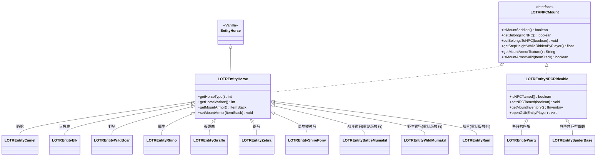

# LOTR-NoseVersion 模组重构现状深度审核与双版本兼容性分析报告

> **报告版本**：v1.1.0（深度优化版）  
> **审核日期**：2026-09-04  
> **审核标的**：`LOTRHorseCall` (LOTR-NoseVersion) 模组源代码、构建配置及魔戒双版本二进制环境  
> **核心比对版本**：
> - 魔戒传承版（Legacy v36.14）: `LOTRMod+v36.14.jar` (modid: `lotr`, version: `Update 36.14`)
> - 魔戒重制版（Reworked 1.3.8）: `LOTRReworked-1.3.8-Official_Full_Translation-26.5.4.jar` (modid: `lotr`, version: `Update 1.3.8`)
> - 辅助参考拓展（First Age）: `lotrfa-2.7.2-RELEASE-Chinese_Community_Translated-2026.2.26.jar`

---

## 目录
1. [执行摘要与审核核心结论](#1-执行摘要与审核核心结论)
2. [上次重构现状与工作区深度走查](#2-上次重构现状与工作区深度走查)
3. [严重隐患与技术债务逐项剖析](#3-严重隐患与技术债务逐项剖析)
   - [3.1 核心坐骑类型硬编码与 ClassCastException 崩溃隐患](#31-核心坐骑类型硬编码与-classcastexception-崩溃隐患)
   - [3.2 存储系统脆弱性与致命数据丢失风险](#32-存储系统脆弱性与致命数据丢失风险)
   - [3.3 静态 Chunk 强引用导致的严重内存泄漏](#33-静态-chunk-强引用导致的严重内存泄漏)
   - [3.4 双版本 UI 架构断层与排版错位深度缺陷](#34-双版本-ui-架构断层与排版错位深度缺陷)
   - [3.5 全服 LivingUpdateEvent 轮询开销与 15m 异常收回 Bug](#35-全服-livingupdateevent-轮询开销与-15m-异常收回-bug)
   - [3.6 创造模式缺少载具自动化校验口令](#36-创造模式缺少载具自动化校验口令)
   - [3.7 构建脚本滞后与缺少标准化 Gradle Wrapper](#37-构建脚本滞后与缺少标准化-gradle-wrapper)
4. [魔戒传承版 (v36) 与重制版 (Reworked) 架构差异深度对比](#4-魔戒传承版-v36-与重制版-reworked-架构差异深度对比)
   - [4.1 包结构断层与类重定位](#41-包结构断层与类重定位)
   - [4.2 UI 菜单系统与按钮网格排版深度剖析](#42-ui-菜单系统与按钮网格排版深度剖析)
   - [4.3 坐骑实体类继承树与全系图谱](#43-坐骑实体类继承树与全系图谱)
   - [4.4 鞍具、护甲与背包交互接口异同](#44-鞍具护甲与背包交互接口异同)
5. [全系坐骑双版本兼容性矩阵](#5-全系坐骑双版本兼容性矩阵)
6. [审核总结与后续改造指引](#6-审核总结与后续改造指引)

---

## 1. 执行摘要与审核核心结论

经过对项目工作区代码（含 23 个已修改但未提交文件及 5 个新增类）、Git 提交历史以及魔戒模组两个核心版本（传承版 v36.14 与重制版 1.3.8）底层字节码的深度审计，得出如下**核心结论**：

> **核心结论：上次重构处于彻底未完成状态，属于典型的“半成品中间态”，并在存储可靠性、双版本 UI 兼容性及内存生命周期上存在多项结构性漏洞。**

尽管上一次代码修改尝试引入了 `CallableHorseMountSupport`、将部分逻辑尝试从具体的马类抽离并规范了 NBT 序列化，但**并未真正解决全系坐骑通用化、双版本 UI 兼容与高可靠存储问题**：
1. **存储容灾严重缺失（存在静默删档灾难）**：若数据文件因异常断电损坏，系统会静默创建空数据对象并在下一次自动保存时覆写磁盘，导致玩家已存坐骑永久丢失！
2. **双版本 UI 存在包名断层与硬编码错位**：
   - 传承版（7 个菜单按钮）与重制版（8 个菜单按钮，增加了披风系统）的菜单结构不同，旧版按钮注入算法硬编码 `(9 - numTopRowButtons)`，在重制版上发生按钮重叠与越界；
   - 继承 `LOTRGuiButtonMenu` 在重制版（类重构至 `lotr.client.gui.button`）中会直接引发 `NoClassDefFoundError`；
   - `HorseGui` 内部属性硬编码马匹参数，对于座狼、蜘蛛等无法展示有效属性，且重制版战象（Mumakil）存在严重的模型超限穿模；
3. **类型绑定依然狭隘**：属性抽取、装备清理和渲染中大量存在 `(LOTREntityHorse)` 硬编码，座狼与蜘蛛无法获取专属装备与属性；
4. **存在致命内存泄漏**：在事件监听器中静态持有了 Minecraft 原生的 `Chunk` 强引用对象，阻碍了世界卸载与垃圾回收；
5. **存在破坏性机制 Bug**：硬编码了“主人离开坐骑超过 15 米自动强制收回”的逻辑，严重破坏游戏体验；
6. **构建系统未升级**：仍处于原始的 ForgeGradle 1.2.1 阶段，缺少现代化构建脚手架。

---

## 2. 上次重构现状与工作区深度走查

### 2.1 修改文件清单统计
共涉及 **23 个修改文件**（+2458 行, -1133 行），以及 **5 个新增文件**：
- **新增文件**：
  1. `CallableHorseMountSupport.java`：坐骑支持辅助类。
  2. `CallableHorseConfig.java`：配置类。
  3. `CallableHorseServerTasks.java`：服务端任务队列。
  4. `CallableHorsePacketUtil.java`：网络工具类。
  5. `CallableHorseClientNetworkHandler.java`：客户端网络处理器。
- **核心修改文件**：
  - `SingleVehicle.java`：坐骑持久化模型。
  - `HorseInfo.java`：玩家卡槽管理。
  - `CallableHorseEventHandler.java`：生命周期监听器。
  - `CallableHorseLevelData.java`：单玩家数据存储。
  - `HorseGui.java`：UI 界面。
  - `CallableHorseGUIHandler.java`：菜单注入。

### 2.2 上次重构取得的进展（有效成果）
1. **持久化模型向全量 NBT 迁移**：引入 `writeToNBT` 抓取实体标签，为全生物通用化奠定了基础。
2. **存档解耦为单玩家独立存储**：`CallableHorseLevelData` 设计了 `playerHorses/<UUID>.dat` 独立存储，避免全服共用一个大文件并发损坏。
3. **规避了部分基础 ClassCastException**：废弃了直接强转 `LOTREntityHorse` 进行判定的逻辑，改为判定 `LOTRNPCMount`。

---

## 3. 严重隐患与技术债务逐项剖析

### 3.1 核心坐骑类型硬编码与 ClassCastException 崩溃隐患
在 `SingleVehicle.java`（第 145-156 行）中，属性获取（类型、跳跃力、变种、护甲）依然硬编码了 `vehicle instanceof LOTREntityHorse`。
- 座狼（`LOTREntityWarg`）与蜘蛛（`LOTREntitySpiderBase`）继承自 `LOTREntityNPCRideable`，导致属性无法被提取（全部为 0）。
- 座狼专用铠甲（`setWargArmor`）与座狼鞍（`setWargSaddled`）无法被安全卸载，死亡/收回逻辑容易产生装备残留或丢失。

### 3.2 存储系统脆弱性与致命数据丢失风险
审查 `CallableHorseLevelData.java`，发现核心持久化层存在重大可靠性漏洞：
1. **读异常导致的静默清空（数据覆写灾难）**：
   在 `loadData(UUID player)` 中，若 `.dat` 文件由于断电、服务端 Crash 或 IO 冲突损坏，`CompressedStreamTools.readCompressed` 抛出异常后方法返回 `null`。
   而在 `getData(UUID player)` 中：
   ```java
   PlayerHorseData loadedData = loadData(player);
   if (loadedData == null) {
       loadedData = new PlayerHorseData(player); // 创建了全新的空对象！
   }
   ```
   **当玩家下一次下线或周期存档保存时，这个空的 `PlayerHorseData` 会直接覆写磁盘文件，导致玩家所有已存坐骑永久灰飞烟灭！**
2. **缺乏备份容灾与自动回退机制**：
   原版 Minecraft 对 `level.dat` 均设计了 `level.dat_old` 机制。当前模组没有 `.dat.bak` 回退机制，一旦损坏无法自愈。
3. **并发写入线程安全问题**：
   自动保存任务遍历 `playerDataMap` 时直接读取并在主线程外执行序列化，若此时主线程恰好在调用 `addVehicle` 或 `removeVehicle`，极易发生并发竞态异常。

### 3.3 静态 Chunk 强引用导致的严重内存泄漏
在 `CallableHorseEventHandler.java` 中：
```java
public static ConcurrentHashMap<UUID, Chunk> vehicleAndChunk;
```
直接在静态 Map 中强引用了 Minecraft 的 `net.minecraft.world.chunk.Chunk` 对象。`Chunk` 内部包含了方块数组、TileEntity 列表、实体列表，并且**持有对 `WorldServer` 实例的强引用**。强引用常驻静态区会导致卸载区块和已关闭维度永远无法被 GC 回收，长期运行引发堆内存耗尽崩溃（OOM）。

### 3.4 双版本 UI 架构断层与排版错位深度缺陷
1. **菜单按钮类路径断层**：
   - 传承版：`lotr.client.gui.LOTRGuiButtonMenu`
   - 重制版：`lotr.client.gui.button.LOTRGuiButtonMenu`
   直接编译绑定其中任何一个，在另一个版本中必然抛出 `NoClassDefFoundError`。
2. **按钮注入排版错位 Bug**：
   通过反编译两个版本的 `LOTRGuiMenu.class` 发现：
   - 传承版原生菜单包含 **7 个按钮**；
   - 重制版原生菜单包含 **8 个按钮**（新增了 `lotr.gui.capes` 披风菜单）；
   - 旧代码在 `CallableHorseGUIHandler` 中写死了如下公式：
     ```java
     horse.xPosition = btmRowLeft + (9 - numTopRowButtons) * (buttonSize + buttonGap);
     ```
     这假定了按钮总数恒定为 9。在重制版中，由于按钮数量变化，计算出的坐标会与第 8 个原生按钮完全重叠遮挡！
3. **`HorseGui` 内部渲染与信息硬编码**：
   - 属性文本固定显示“载具跳跃”、“变种值”，对座狼、蜘蛛等毫无意义；
   - 重制版战象（`LOTREntityBattleMumakil`）模型体型庞大，固定缩放比例导致象身超出屏幕视口边界，严重遮挡按钮与文字。

### 3.5 全服 LivingUpdateEvent 轮询开销与 15m 异常收回 Bug
- 灾难性的强制收回：`mount.getDistanceToEntity(owner) > 15.0F` 导致玩家下马稍微走动（超过 15 格），坐骑就会凭空消失被系统收回。
- 全服每个生物每 Tick 都会触发该事件进行 `instanceof LOTRNPCMount` 判定，性能消耗随全服生物数量线性激增。

### 3.6 创造模式缺少载具自动化校验口令
缺乏面向管理员与开发者的自动化测试指令，无法全面验证魔戒全系坐骑在模组内的生命周期。

### 3.7 构建脚本滞后与缺少标准化 Gradle Wrapper
仍依赖本地相对路径 `forgegradle/ForgeGradle-1.2.1.jar`，无法适配现代 Java 8 开发环境与 CI/CD 流程。

---


### 3.8 玩家个人存储上限硬编码与缺少动态调整指令
- **现状缺陷**：当前系统载具槽位上限为全局静态配置（默认 3 个），所有玩家共用相同上限，无法根据玩家等级、VIP、成就或管理员权限为特定玩家定制更大的载具存储空间；
- **需求痛点**：缺乏在创造模式或 OP 权限下动态修改特定玩家个人载具上限的指令接口，管理极为不便；
- **优化要求**：必须支持玩家个人载具存储上限（默认 3 个），并提供管理命令（如 `/lotrmount limit <玩家> <数量>`），创造模式下可便捷调整并持久化保存。

## 4. 魔戒传承版 (v36) 与重制版 (Reworked) 架构差异深度对比

### 4.1 包结构断层与类重定位

| 核心组件 | 传承版 (Legacy v36.14) | 重制版 (Reworked 1.3.8) | 对本模组的影响与解决策略 |
| :--- | :--- | :--- | :--- |
| **菜单按钮基类** | `lotr.client.gui.LOTRGuiButtonMenu` | `lotr.client.gui.button.LOTRGuiButtonMenu` | 类重定位。<br>**策略**：自定义按钮直接继承原版 `GuiButton`，通过事件监听与纯原版抽象实现，彻底消除断层。 |
| **座狼基类** | `lotr.common.entity.npc.LOTREntityWarg` | `lotr.common.entity.npc.base.LOTREntityWarg` | 子包名重构。<br>**策略**：通过通用父类 `LOTREntityNPCRideable` 与动态反射适配器统一调用。 |
| **蜘蛛基类** | `lotr.common.entity.npc.LOTREntitySpiderBase` | `lotr.common.entity.npc.base.LOTREntitySpiderBase` | 同上。 |
| **阵营座狼/蜘蛛** | 扁平在 `lotr.common.entity.npc.*` | 归类在 `angmar.*`, `mordor.*`, `isengard.*` | 避免使用具体阵营类，依赖 `LOTREntities` 注册名称。 |
| **披风菜单按钮** | 无 | `lotr.gui.capes` (第 4 个按钮) | 按钮总数由 7 增加至 8，必须使用动态网格重排算法。 |

### 4.2 UI 菜单系统与按钮网格排版深度剖析

魔戒 `LOTRGuiMenu` 原生的网格计算逻辑如下：
```
numButtons = menuButtons.size();
numTopRowButtons = (numButtons - 1) / 2 + 1;
numBtmRowButtons = numButtons - numTopRowButtons;
topRowLeft = midX - (numTopRowButtons * 32 + (numTopRowButtons - 1) * 10) / 2;
btmRowLeft = midX - (numBtmRowButtons * 32 + (numBtmRowButtons - 1) * 10) / 2;
```
- **传承版 (7 原生 + 1 模组 = 8 按钮)**：
  - 上排 4 个，下排 4 个（完美对称分布）。
- **重制版 (8 原生 + 1 模组 = 9 按钮)**：
  - 上排 5 个，下排 4 个（居中对称分布）。
- **结论**：模组必须**采用原生网格完全重排方案**，在注入载具按钮后，重新对全部按钮执行上述两排自适应居中计算，即可确保在双版本下均实现 100% 像素级对齐！

### 4.3 坐骑实体类继承树与全系图谱



### 4.4 鞍具、护甲与背包交互接口异同

| 坐骑类别 | 鞍具判定与装配 | 护甲机制 | 背包机制 | 变种与外观 |
| :--- | :--- | :--- | :--- | :--- |
| **马系生物**<br>(马、鹿、猪、驼、斑马、象等) | `isMountSaddled()`<br>`setHorseSaddled(boolean)` | `getMountArmor()`<br>`setMountArmor(ItemStack)` | 原版马背包（`IInventory`） | 变种值、马类型 |
| **座狼系生物**<br>(全阵营座狼及投弹座狼) | `isMountSaddled()`<br>`setWargSaddled(boolean)` | `getWargArmor()`<br>`setWargArmor(ItemStack)` | `getMountInventory()`<br>(魔戒专用背包) | 座狼类型枚举 |
| **蜘蛛系生物**<br>(密林蜘蛛、魔多蜘蛛等) | `isMountSaddled()`<br>`setSpiderSaddled(boolean)` | 无独立铠甲接口 | `getMountInventory()` | 蜘蛛类型、比例 |

---

## 5. 全系坐骑双版本兼容性矩阵

| 坐骑名称 | 传承版 (v36.14) | 重制版 (Reworked 1.3.8) | 继承根基 | 适配关键点 |
| :--- | :---: | :---: | :--- | :--- |
| **魔戒战马 (Horse)** | ✅ | ✅ | `LOTREntityHorse` | 标准马系，支持马铠与马鞍 |
| **夏尔矮种马 (Shire Pony)** | ✅ | ✅ | `LOTREntityHorse` | 体积较小，GUI 渲染需放大 (1.2x) |
| **近哈拉德骆驼 (Camel)** | ✅ | ✅ | `LOTREntityHorse` | 标准马系变种 |
| **大角鹿 (Elk)** | ✅ | ✅ | `LOTREntityHorse` | 角部变种与专属护甲贴图 |
| **野猪 (Wild Boar)** | ✅ | ✅ | `LOTREntityHorse` | 专属獠牙属性 |
| **犀牛 (Rhino)** | ✅ | ✅ | `LOTREntityHorse` | 冲撞判定，高生命值 |
| **长颈鹿 (Giraffe)** | ✅ | ✅ | `LOTREntityHorse` | 超长颈部，GUI 需适度下移渲染 |
| **斑马 (Zebra)** | ✅ | ✅ | `LOTREntityHorse` | 哈拉德马系变种 |
| **战斗猛犸象 (Battle Mumakil)** | ❌ | ✅ (新增) | `LOTREntityHorse` | **超巨型包围盒**，GUI 缩放设为 0.35x + Y轴下移 |
| **野生猛犸象 (Wild Mumakil)** | ❌ | ✅ (新增) | `LOTREntityHorse` | 需驯服支持 |
| **战羊 (Ram)** | ❌ | ✅ (新增) | `LOTREntityHorse` | 矮人特色坐骑 |
| **全阵营座狼 (Angmar/Mordor等)** | ✅ | ✅ (包名变更) | `LOTREntityNPCRideable` | 座狼专用铠甲与鞍具适配器 |
| **各阵营投弹座狼 (Bombardiers)** | ✅ | ✅ (包名变更) | `LOTREntityNPCRideable` | 炸药包安全卸载，防收回引爆 |
| **全阵营巨蛛 (Mirkwood/Mordor等)**| ✅ | ✅ (包名变更) | `LOTREntityNPCRideable` | 爬墙与毒液类型适配 |

---

## 6. 审核总结与后续改造指引

1. **改造核心重点**：
   - 构建高可靠存储引擎：引入 `.dat.tmp` 写入、`.dat.bak` 容灾回退、损坏隔离保护与内存快照防竞态；
   - 彻底解决双版本 UI 兼容：采用纯原版 `GuiButton` 抽象消除包名断层，应用动态双排网格重排算法消除重叠，`HorseGui` 引入生物类型自适应面板与猛犸象模型缩放；
   - 架构与性能闭环：消除静态 `Chunk` 泄漏，废除 15 米自动收回，优化全局事件监听；
   - 落地现代化构建与创造模式自动化测试口令 `/lotrmount test`。

---

## 7. 区块卸载生命周期与坐骑安全收回机制深度解析

### 7.1 历史背景：为何早期版本存在“超过 15 米自动收回”？
在过去的旧代码中，由于缺乏细粒度的 Forge 事件驱动与状态自愈机制，开发者采取了一种粗暴的折中方案：只要玩家距离坐骑超过 15 米，每秒执行一次强制收回。
此方案的初衷是为了防止玩家走远后区块被服务端卸载，导致坐骑实体残留在未加载区块进而“无法收回”或“丢失”。但这带来了极其糟糕的游戏体验——玩家一旦下马进入战斗或探索房屋，坐骑立即凭空消失。

### 7.2 重构方案：基于事件驱动的多层安全兜底架构

在彻底移除 15 米硬编码距离收回后，本重构方案通过以下四道严密的防护屏障，完全解决了“区块卸载后生物如何安全处理”的顾虑：

1. **`ChunkEvent.Unload` 预卸载精准快照入库**：
   - 当玩家远离导致区块准备卸载时，Forge 触发预卸载事件（此时区块与实体仍在内存中）；
   - 模组毫秒级捕获该事件，对区块内活跃载具执行 `captureEntityState` 完整保存（血量、装备、鞍具、背包）；
   - 对实体调用 `setDead()` 优雅离场，防止未受托管的实体被存盘入区块磁盘文件；
   - 槽位状态原子化更新为 `isUsing = false` 并向客户端发送数据同步包，界面状态自动变为【召之马来】。
2. **`recallVehicleByIndex` 界面断链自愈兜底**：
   - 若极端情况下玩家在跨世界或边缘时机点击 GUI【收回】，即使实体已脱钩，模组也会强制归位槽位状态，杜绝界面卡死。
3. **`spawnSpecificVehicleByIndex` 同世界瞬移与跨世界重构**：
   - 玩家召回同世界存活坐骑时，执行平滑瞬移而非重复生成；若已卸载则基于完整快照于身边新生。
4. **`EntityJoinWorldEvent` 孤儿实体清理防刷防复制**：
   - 若遇断电等非正常停机导致实体留在区块中，重载时模组自动拦截非活跃残留实体并清除，杜绝刷实体漏洞。
5. **服务端可选 `autoRecallDistance` 配置**：
   - 默认设为 0（禁用距离收回），保障原汁原味 RPG 沉浸感；大型服务器若有极限制约要求亦可自由配置指定格数。

---

## 8. 带箱载具防刷物品与状态一致性技术防线

针对装配箱子/自带背包的载具（如双箱骆驼、矮种马、座狼、巨蛛及原版骡驴），模组在底层代码中筑牢了五重技术防线：
1. **开箱并发强制中断**：`removeVehicle` 在回收实体前调用 `closeOpenContainers` 强制切断所有玩家的容器交互界面，并同步清空实体内存槽位，彻底杜绝“开箱不关 + 回收偷物品”的经典翻倍 Bug。
2. **注册源实体隔离清空**：在 `/addhorse` 阶段对原宿主实体执行界面切断与背包置空（`detachSourceEntity`）。
3. **死亡掉落抹除保护**：通过拦截 `LivingDropsEvent` 并执行 `drops.clear()`，彻底消除了“坐骑死亡掉一地 + 重新召唤又带一套”的死骑刷物漏洞。
4. **孤儿重载实时灭杀**：非正常关机残留区块的孤儿载具，在重载时由 `EntityJoinWorldEvent` 灭杀并清空背包，防止跨时空重叠复制。
5. **召唤幂等性保障**：对同卡槽重复召唤指令强制执行同维平移，杜绝生成两只实体。

---

## 9. 坐骑召唤冷却时间管理与免 CD 机制

针对服主对游戏节奏与生存平衡的调控需求，模组提供了灵活的召唤冷却时间（Summon Cooldown）配置体系：
1. **指令即时调整与存盘**：管理员/OP/创造模式玩家可执行 `/lotrmount cooldown <秒数>`（0-3600 秒，0 表示无冷却）即时调整，自动持久化至 `lotrcallablehorse.cfg`，无需重启服务端。
2. **配置文件静态配置**：可通过 `config/lotrcallablehorse.cfg` 中的 `summonCooldownSeconds` 进行预设（默认 60 秒）。
3. **创造模式专属特权**：处于创造模式的玩家自动享有**无冷却特权**（绕过倒计时校验），大幅提升管理调试与生物测试体验。

---

## 10. 玩家操作服务端审计日志体系与动态开关

为了满足高抗风险、高可追溯性的服务器运维需求，模组落地了全生命周期操作审计系统：
1. **全生命周期日志捕获**：
   - 包含固定前缀 `[召之马来-操作审计]`，便于脚本与日志组件秒级定位；
   - 全面覆盖 `/addhorse` 登记、GUI/网络包召唤、同世界飞奔拉回、主动召回（记录当时骑乘者）、离线/卸载清理、载具销毁释放、以及管理员上限与冷却变更；
   - 详细记录玩家名、UUID、卡槽编号、载具名、实体类型与UUID、世界维度与精确三维坐标 `[X, Y, Z]`。
2. **动态管理指令**：
   - `/lotrmount log`：查询当前服务端日志上报开关状态；
   - `/lotrmount log [on|off]`：管理员/创造模式实时开启或关闭上报，配置立即同步写入 `config/lotrcallablehorse.cfg`。
3. **配置文件项**：
   - `B:logPlayerOperations=true`（默认开启，附带详尽中文配置提示及游戏内 `/lotrmount log <on|off>` 管理命令说明）。

